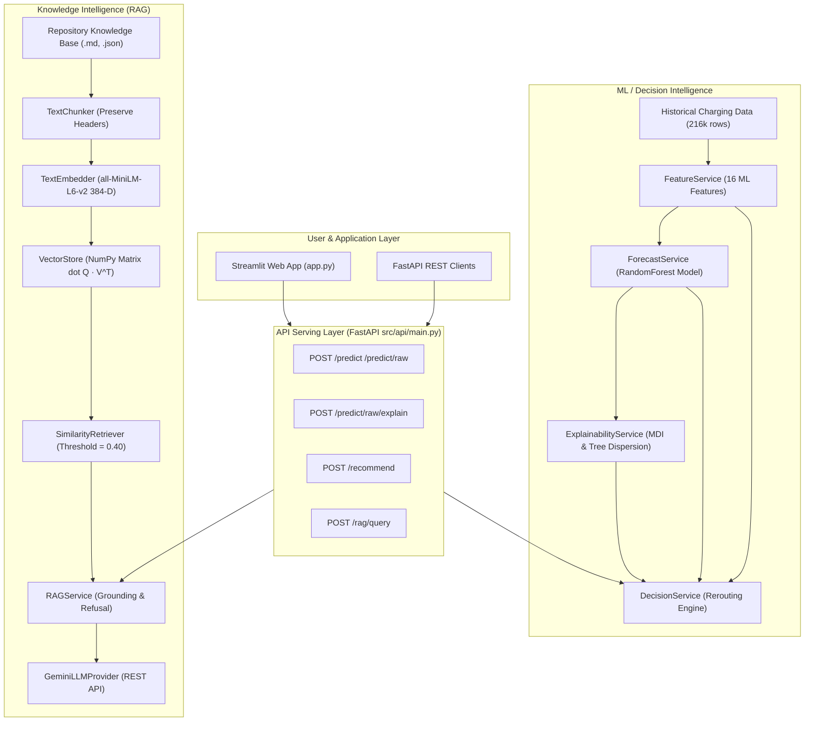

# ChargeFlow AI V2 — EV Charging Station Intelligence Platform

[](https://www.python.org/)
[](https://fastapi.tiangolo.com/)
[](https://streamlit.io/)
[](https://scikit-learn.org/)
[](https://www.sbert.net/)
[](LICENSE)

**ChargeFlow AI V2** is an end-to-end, production-style AI engineering platform for EV charging demand forecasting, model explainability, dense sentence-embedding RAG knowledge intelligence, and automated station rerouting decisions across India's EV charging network.

---

## 🎯 Problem Statement

India's EV ecosystem faces a critical infrastructure imbalance:
*   **Low Average Utilization**: Public EV charger utilization in India averages **23%**, compared to an industry optimal target of **65%+**.
*   **Peak Congestion & Long Wait Times**: EV drivers experience severe queueing at popular hub stations during peak hours (7–10 AM and 6–9 PM), while nearby alternative chargers remain underutilized.
*   **Uncoordinated Rerouting**: Drivers lack predictive insights into future station occupancy, leading to dynamic congestion bottlenecks.

ChargeFlow AI V2 solves this problem by combining **time-series ML demand forecasting**, **model explainability diagnostics**, **dense-embedding RAG knowledge retrieval**, and **deterministic rerouting decision policies**.

---

## 🏗️ System Architecture



---

## 📊 Data Engineering Foundation (Phase 1)

*   **Corpus**: 216,000 hourly historical time-series records across 50 EV charging stations (`STA001` to `STA050`) in 5 major Indian cities (`Bengaluru`, `Delhi`, `Mumbai`, `Hyderabad`, `Pune`) for 180 days (Jan 1, 2025 to Jun 30, 2025).
*   **Temporal Features**: `hour`, `day_of_week`, `month`, `is_weekend`, `is_holiday`.
*   **Cyclical Encodings**: `hour_sin`, `hour_cos`, `day_sin`, `day_cos` mapped to the unit circle.
*   **Historical Lags & Rolling Statistics**: `lag_1h`, `lag_24h`, `lag_168h` (1-week lag), `rolling_mean_6h`, `rolling_mean_24h`, `rolling_std_24h`.
*   **Data Leakage Prevention**: Strict chronological train/validation/test splitting (Jan–Apr train, May validation, June test) ensuring all lag/rolling features use strictly past timestamps ($\Delta t < t$).

---

## 🔮 ML Demand Forecasting (Phase 2 & 4)

*   **Model Architecture**: `RandomForestRegressor` with 200 estimators trained on 16 pre-engineered features.
*   **Evaluation Metrics (vs. Seasonal $t-24h$ Baseline)**:
    *   **RandomForest Test $R^2$**: `0.884` (vs. Seasonal Baseline `0.651`)
    *   **Mean Absolute Error (MAE)**: `0.052` (5.2% occupancy error)
    *   **Root Mean Squared Error (RMSE)**: `0.076`
*   **Raw Feature Serving (`FeatureService`)**: Accepts raw user inputs (`station_id`, `prediction_time`, `temperature_c`, `is_holiday`) and dynamically builds the exact 16-feature vector from historical data without training-serving skew.

---

## 🔍 Model Explainability & Diagnostics (Phase 5)

*   **Global Feature Importance**: Mean Decrease in Impurity (MDI) ranking top features (`hour`, `rolling_mean_24h`, `lag_24h`).
*   **Tree Estimator Dispersion**: Computes the distribution across all 200 individual decision trees in the RandomForest (`tree_mean`, `tree_std`, `p10`, `p90`, `status_consensus_pct`).
    > ⚠️ **Technical Disclaimer**: Tree dispersion represents variation among individual Random Forest decision trees and is **NOT** a calibrated statistical confidence interval.
*   **Thread-Safe Inference Logging**: Writes structured prediction records to `logs/inference_log.jsonl` for auditability.

---

## 📚 Dense Sentence Embedding RAG (Phase 6)

*   **Dense Embeddings**: `SentenceTransformer("all-MiniLM-L6-v2")` generating 384-dimensional L2-normalized dense vectors.
*   **Vector Store Math**: In-memory matrix multiplication ($Q \cdot V^T$) executing exact Cosine Similarity queries in $< 15$ ms on CPU without external vector DB dependencies.
*   **Evidence-Based Refusal**: Hard similarity score thresholding ($S_{min} = 0.40$). If no document chunk meets $0.40$ similarity, the system returns `grounded=False` refusal text **WITHOUT calling the LLM**.
*   **LLM Provider**: REST API integration with Google Gemini (`gemini-2.5-flash`). Decoupled so retrieval and refusal function 100% offline without API keys.

---

## 🧭 AI Decision & Recommendation Engine (Phase 7)

*   **Candidate Alternative Selection**: Filters stations in `data/stations.csv` by `same city`, `compatible charger standard` (`CCS2`, `TYPE 2`, `CHADEMO`), excluding self (`station_id != target`).
*   **Deterministic Ranking Policy**:
    1.  `predicted_occupancy` **ASCENDING** (Primary: lowest demand wins)
    2.  `distance_km` **ASCENDING** (Secondary tie-breaker: Haversine distance)
    3.  `station_id` **ASCENDING** (Tertiary tie-breaker)
*   **Transparent Decision Policy**:
    *   `BUSY_THRESHOLD = 0.70` (70% predicted occupancy)
    *   `MIN_OCCUPANCY_IMPROVEMENT = 0.10` (10% occupancy reduction required to reroute)
    *   **STAY**: `target_occupancy < 0.70`
    *   **REROUTE**: `target_occupancy >= 0.70` AND `occupancy_improvement >= 0.10`
    *   **NO_BETTER_ALTERNATIVE**: `target_occupancy >= 0.70` but best candidate improvement $< 0.10$.
    > ℹ️ **Policy Note**: Thresholds are deterministic product-policy rules, not learned model parameters.

---

## ⚡ FastAPI Reference

Start server: `python -m uvicorn src.api.main:app --reload` (port 8000).

### 1. Raw Prediction (`POST /predict/raw`)
```bash
curl -X POST "http://localhost:8000/predict/raw" \
     -H "Content-Type: application/json" \
     -d '{
       "station_id": "STA001",
       "prediction_time": "2025-06-15 19:00:00",
       "temperature_c": 28.0,
       "is_holiday": false
     }'
```

### 2. Decision Engine Rerouting (`POST /recommend`)
```bash
curl -X POST "http://localhost:8000/recommend" \
     -H "Content-Type: application/json" \
     -d '{
       "station_id": "STA001",
       "prediction_time": "2025-06-15 19:00:00",
       "temperature_c": 28.0,
       "is_holiday": false,
       "max_alternatives": 3,
       "include_rag_context": false
     }'
```

### 3. Knowledge Intelligence Query (`POST /rag/query`)
```bash
curl -X POST "http://localhost:8000/rag/query" \
     -H "Content-Type: application/json" \
     -d '{
       "question": "What features does the demand forecasting model use?",
       "top_k": 3
     }'
```

---

## 💻 Local Setup Instructions (Windows PowerShell)

```powershell
# 1. Clone repository
git clone https://github.com/your-username/ChargeFlow-AI.git
cd ChargeFlow-AI

# 2. Pull large model weight files via Git LFS
git lfs install
git lfs pull

# 3. Create virtual environment
python -m venv .venv
.\.venv\Scripts\Activate.ps1

# 4. Upgrade pip and install dependencies
python -m pip install --upgrade pip
pip install -r requirements.txt

# 5. Copy environment variable template (Optional: set GEMINI_API_KEY)
copy .env.example .env
```

---

## 🚀 Running the Applications

### Run Streamlit Web Application
```powershell
python -m streamlit run app.py
```
Open `http://localhost:8501` in your web browser.

### Run FastAPI REST API Server
```powershell
python -m uvicorn src.api.main:app --reload --host 0.0.0.0 --port 8000
```
Open Interactive OpenAPI Docs at `http://localhost:8000/docs`.

---

## 🧪 Automated Testing

Run the complete 136-test regression suite:
```powershell
python -m unittest discover -s tests -p "test_*.py" -v
```
> **Baseline**: `136` tests passing locally (0 failures, 0 errors).

---

## 🐳 Docker Containerization

Build and run ChargeFlow AI V2 in an isolated container:

```bash
# Build Docker image
docker build -t chargeflow-ai .

# Run Streamlit container on port 8501
docker run -p 8501:8501 -e GEMINI_API_KEY="your_api_key_here" chargeflow-ai

# Or run FastAPI server on port 8000
docker run -p 8000:8000 chargeflow-ai python -m uvicorn src.api.main:app --host 0.0.0.0 --port 8000
```

---

## ⚖️ Limitations & Technical Disclaimers

1.  **Synthetic/Project Dataset**: Time-series charging data is project-engineered data spanning Jan 1 to Jun 30, 2025.
2.  **Model Forecasts vs. Live Telemetry**: Occupancy values represent **ML model predictions**, not real-time IoT hardware charger availability.
3.  **Uncertainty Quantification**: Tree estimator dispersion reflects variation across individual decision trees in the ensemble and is not a calibrated statistical confidence interval.
4.  **Evidence-Based Refusal**: RAG retrieval refuses out-of-domain queries when similarity score $< 0.40$. Answer generation requires a valid `GEMINI_API_KEY`.

---

## 🔮 Future Enhancements

*   Live OCPP / OCPI telemetry protocol integration.
*   Calibrated prediction intervals via Conformal Prediction.
*   Automated model drift monitoring and retraining pipelines.

---

## 📄 License

Distributed under the MIT License. See `LICENSE` for details.
